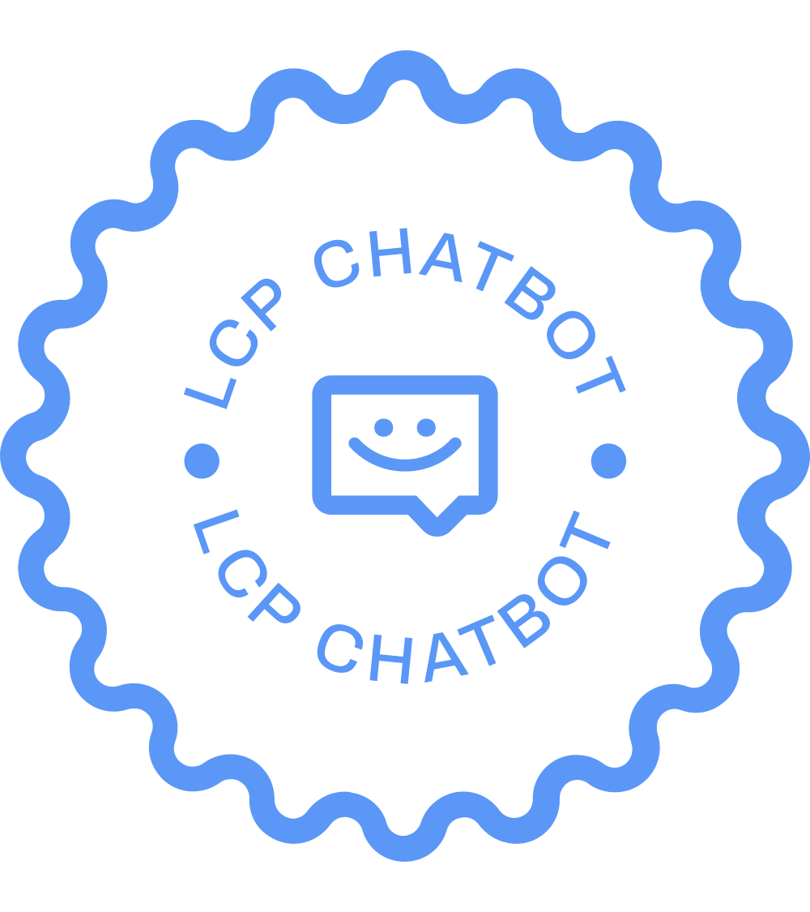

# LCPChatBot

<!--  -->

    

LCPChatBot is bot for chat powered by OpenAI ChatGPT and interact between user and AI for the server of discord Luigi Gaming'n'Tech (or for your server), created by Luis "Luigi" Carvalho in 2023.

## **Usage:**

> 
> 1. Clone or download this project;
> 2. Go to this project and install it (npm install);
> 3. Execute the command: npm run start;
> 4. After starting, if it works and gets the status online, then use to talk bot: 
> 

`
    !chatbox <msg> or !cb <msg> (replace <msg> to your message, if it stops, use the keyword "continue" or "Continue").
`

**Note**: 
Theres limitations and restrictions regarding about using this bot:
1. [OpenAI API - Usage policies](https://beta.openai.com/docs/usage-policies)
2. [OpenAI API - Rate limits](https://beta.openai.com/docs/guides/rate-limits)

**Note 2**: 
If this bot isnt working, please report it in [issues](https://github.com/carvalholuigi25/lcpchatbot/issues) tab or send [email to me](carvalholuigi25@gmail.com).

## **License**:

Copyright 2023 &copy; LCP

Permission is hereby granted, free of charge, to any person obtaining a copy of this software and associated documentation files (the "Software"), to deal in the Software without restriction, including without limitation the rights to use, copy, modify, merge, publish, distribute, sublicense, and/or sell copies of the Software, and to permit persons to whom the Software is furnished to do so, subject to the following conditions:

The above copyright notice and this permission notice shall be included in all copies or substantial portions of the Software.

THE SOFTWARE IS PROVIDED "AS IS", WITHOUT WARRANTY OF ANY KIND, EXPRESS OR IMPLIED, INCLUDING BUT NOT LIMITED TO THE WARRANTIES OF MERCHANTABILITY, FITNESS FOR A PARTICULAR PURPOSE AND NONINFRINGEMENT. IN NO EVENT SHALL THE AUTHORS OR COPYRIGHT HOLDERS BE LIABLE FOR ANY CLAIM, DAMAGES OR OTHER LIABILITY, WHETHER IN AN ACTION OF CONTRACT, TORT OR OTHERWISE, ARISING FROM, OUT OF OR IN CONNECTION WITH THE SOFTWARE OR THE USE OR OTHER DEALINGS IN THE SOFTWARE.